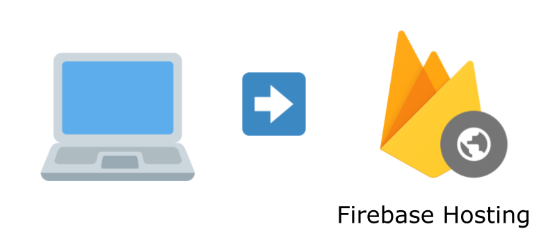

# パブリッククラウドにおける\\nQUIC現状確認2023年8月編

author
:  unasuke (Yusuke Nakamura)

content-source
:  CloudNative Days Fukuoka 2023

date
:  2023-08-03

theme
:  theme

# 自己紹介

* Name: うなすけ
* Work: フリーランス
* Kaigi on Rails オーガナイザー (10/27-28 開催)
* RubyでQUICを実装しようとしている
* {::tag name='x-small'}GitHub <https://github.com/unasuke>{:/tag}
* {::tag name='x-small'}ActivityPub <https://mstdn.unasuke.com/@unasuke>{:/tag}
* {::tag name='x-small'}X (Twitter) <https://twitter.com/yu_suke1994>{:/tag}

{:relative_width='24' align='right' relative_margin_right='-8' relative_margin_top='20'}

# "QUIC" ?

* > QUIC is a secure general-purpose transport protocol.
  * <https://www.rfc-editor.org/rfc/rfc9000.html>
* 2021年5月に標準化
* UDPを用いる
* [QUICをゆっくり解説 – 新しいインターネット通信規格 \| IIJ Engineers Blog](https://eng-blog.iij.ad.jp/quic)

# 実はもう身近なQUIC

* <https://www.youtube.com>
* <https://fonts.google.com/>
  * <https://fonts.gstatic.com>

気づいていないだけで、普段の通信の数割はもうQUICかも

# 最近のQUIC

* QUIC Version 2 (2023-05)
  * <https://www.rfc-editor.org/rfc/rfc9369.html>
  * > QUIC version 2 is meant to mitigate ossification concerns and exercise the version negotiation mechanisms.
* IETF 117 San Francisco (2023-07-24〜)
  * draft-ietf-quic-multipath-05
  * draft-ietf-quic-load-balancers-16
  * draft-ietf-quic-reliable-stream-reset-01
  * etc

# NGINX 1.25.0

{:relative_width="90" align="center"}

{:.center}
{::tag name='x-small'}<https://nginx.org>{:/tag}

# このセッションで話すこと

* 静的WebサイトでQUICを使う
* アプリケーションプロセスに対してQUICでアクセスする
  * AWS, GCP
  * NGINX, H2O
* **2023年8月時点での状況**

# このセッションで話さないこと

* QUICをサービスに導入する際の注意事項
  * 話者にQUICのproductionでの運用経験はありません
  * まだ仕様が固まってない(後述)

# 前準備

{:relative_width='70' align='center'}

{:.center}
Open DevTools!

# テスト用Webサイトについて
* <https://github.com/unasuke/cndf2023-infra>
* inspired by <https://www.httpvshttps.com>
* HTTP/2との速度比較が目的**ではない**
  * 同じ経路でHTTP/2とHTTP/3を両方用意するのがちょっと面倒
  * 多分わかりやすい差が出ない
* 長くても2023年8月いっぱいまでしか動かしません
  * 静的なものは残すかも

# 静的WebサイトでQUICを使う
* Firebase Hosting (Fastly)
* Cloudflare Pages
* AWS CloudFront & S3
* GCP Cloud Load Balancing & Cloud Storage

# Firebase Hosting (Fastly)

{:relative_width='70' align='center'}

* <https://firebase.cndf2023.unasuke.dev>
* Fastlyによる配信
  * <https://firebase.google.com/terms/subprocessors>

# Cloudflare Pages

{:relative_width='70' align='center'}

* <https://cndf2023.unasuke.dev>
* 正確にはこれはCloudflareをCloudFrontの前段に配置したもの

# AWS CloudFront & S3

{:relative_width='70' align='center'}

* <https://aws-cloudfront-s3.cndf2023.unasuke.dev>
* CloudFrontは明示的にHTTP/3を有効にできる
  * <https://aws.amazon.com/jp/about-aws/whats-new/2022/08/amazon-cloudfront-supports-http-3-quic/>

# CloudFrontは明示的にHTTP/3を有効にできる

{:relative_width='90' align='center'}

# AWS CloudFront & S3 (HTTP/3 VS HTTP/2)

* HTTP/3 (QUIC)
  * <https://aws-cloudfront-s3.cndf2023.unasuke.dev>
* HTTP/2
  * <https://aws-cloudfront-s3-http2.cndf2023.unasuke.dev>
* 違いが体感できますか？

# GCP Cloud Load Balancing & Cloud Storage

{:relative_width='70' align='center'}

* <https://gcp-lb-storage.cndf2023.unasuke.dev>
* Cloud Storage単体でも……？

# 動的なアプリケーションでQUICを使う
* AWS CloudFront & ALB & Fargate
* AWS NLB & Fargate
* GCP Cloud Load Balancing & Cloud Run

# AWS CloudFront & ALB & Fargate

{:relative_width='80' align='center'}

* {::tag name='small'}<https://aws-cloudfront-fargate-nginx.cndf2023.unasuke.dev>{:/tag}
  * nginx
* {::tag name='small'}<https://aws-cloudfront-fargate-h2o.cndf2023.unasuke.dev>{:/tag}
  * h2o

# AWS NLB & Fargate

{:relative_width='80' align='center'}

* <https://aws-nlb-fargate-nginx.cndf2023.unasuke.dev>
  * nginx
* <https://aws-nlb-fargate-h2o.cndf2023.unasuke.dev>
  * h2o

# AWS NLB & Fargate
* NLBとFargateの組み合わせでUDP通信ができるようになっている(2020年)
  * [AWS Fargate for Amazon ECS が Network Load Balancer を使用した UDP ロードバランシングのサポートを開始](https://aws.amazon.com/jp/about-aws/whats-new/2020/07/aws-fargate-for-amazon-ecs-now-supports-udp-load-balancing-with-network-load-balancer/)

# GCP Cloud Load Balancing & Cloud Run

{:relative_width='80' align='center'}

* <https://gcp-lb-cloudrun-nginx.cndf2023.unasuke.dev>
* <https://gcp-lb-cloudrun-h2o.cndf2023.unasuke.dev>
* Cloud Run単体でも……？

# GCP Cloud Load Balancer

{:relative_width='55' align='center'}

* {::tag name='small'}[ロードバランサの機能比較  \|  負荷分散  \|  Google Cloud](https://cloud.google.com/load-balancing/docs/features?hl=ja#protocol-to-backends){:/tag}
* {::tag name='small'}[Cloud CDN とロード バランシングで QUIC を使用して HTTP/3 でコンテンツを取得 \| Google Cloud 公式ブログ](https://cloud.google.com/blog/ja/products/networking/cloud-cdn-and-load-balancing-support-http3){:/tag}

# QUICをLoad Balancingするということ

* <https://datatracker.ietf.org/doc/draft-ietf-quic-load-balancers/>
  * [HTTP/3をUDPロードバランサで分散するときの問題点 (AWS NLBで試してみた) - ASnoKaze blog](https://asnokaze.hatenablog.com/entry/2019/12/30/201331)
  * [インフラエンジニアなら気になるQUICのロードバランサ (方式編) \| by Jun-ya Kato \| nttlabs \| Medium](https://medium.com/nttlabs/quic-load-balancer-design-82c5fbae8305)
  * <https://github.com/F5Networks/quic-lb>
* 議論&実験中

# 余談: QUICを受け付ける
* `Alt-Srv` ヘッダ
  * `Alt-Svc: h3=":9443";ma=300;`
  * <https://www.rfc-editor.org/rfc/rfc7838>
  * <https://datatracker.ietf.org/doc/draft-duke-httpbis-quic-version-alt-svc/>
* DNS `HTTPS` レコード
  * <https://datatracker.ietf.org/doc/draft-ietf-dnsop-svcb-https/>

# 個人的所感
* CDNを前段に挟める静的WebサイトでQUICを使うのはよさそう
  * 趣味の範囲でもHTTP/3を使える
* Web AppがQUICを受け付るのはまだ発展途上
  * 標準化が見えてきている
  * HTTP/2で通信できていれば十分なのでは
    * HTTP/3にできなくて困るケースって？
  * 静的assetsだけはHTTP/3というのは一手？

# まとめ 2023年8月

* 実は既に日常生活でQUICが使われている
* 静的WebサイトでHTTP/3を有効にするのはすぐできる時代
* 大手CNDもHTTP/3での配信が可能
  * 静的なassetsだけHTTP/3で配信というのはアリかも
* QUIC-awareなload balancingはまだ議論段階

# 参考URL (1/2)
* [QUICをゆっくり解説 – 新しいインターネット通信規格 \| IIJ Engineers Blog](https://eng-blog.iij.ad.jp/quic)
* [サイトの HTTP3 化と DNS HTTPS RR および Alt-Svc Header によるアドバタイズ \| blog.jxck.io](https://blog.jxck.io/entries/2022-02-05/http3.html)
* [AWS Fargate for Amazon ECS が Network Load Balancer を使用した UDP ロードバランシングのサポートを開始](https://aws.amazon.com/jp/about-aws/whats-new/2020/07/aws-fargate-for-amazon-ecs-now-supports-udp-load-balancing-with-network-load-balancer/)
* [ロードバランサの機能比較  \|  負荷分散  \|  Google Cloud](https://cloud.google.com/load-balancing/docs/features?hl=ja#protocol-to-backends)
* [Cloud CDN とロード バランシングで QUIC を使用して HTTP/3 でコンテンツを取得 \| Google Cloud 公式ブログ](https://cloud.google.com/blog/ja/products/networking/cloud-cdn-and-load-balancing-support-http3)
* <https://datatracker.ietf.org/doc/draft-ietf-quic-load-balancers/>
* [HTTP/3をUDPロードバランサで分散するときの問題点 (AWS NLBで試してみた) - ASnoKaze blog](https://asnokaze.hatenablog.com/entry/2019/12/30/201331)

# 参考URL (2/2)
* [インフラエンジニアなら気になるQUICのロードバランサ (方式編) \| by Jun-ya Kato \| nttlabs \| Medium](https://medium.com/nttlabs/quic-load-balancer-design-82c5fbae8305)
* [QUIC-LBを読んでみる Zenn](https://zenn.dev/eugene/articles/3b730bac2759da)
* <https://github.com/F5Networks/quic-lb>
* [HTTP/3でQUICv2を使うためのalt-svc拡張 - ASnoKaze blog](https://asnokaze.hatenablog.com/entry/2022/03/06/005252)
* [HTTPSの接続情報を通知する "HTTPS DNSレコード" の提案仕様 (2021/07更新) - ASnoKaze blog](https://asnokaze.hatenablog.com/entry/2020/07/19/234103)
* <https://datatracker.ietf.org/doc/draft-duke-httpbis-quic-version-alt-svc/>
* <https://www.rfc-editor.org/rfc/rfc7838>
* <https://datatracker.ietf.org/doc/draft-ietf-dnsop-svcb-https/>
